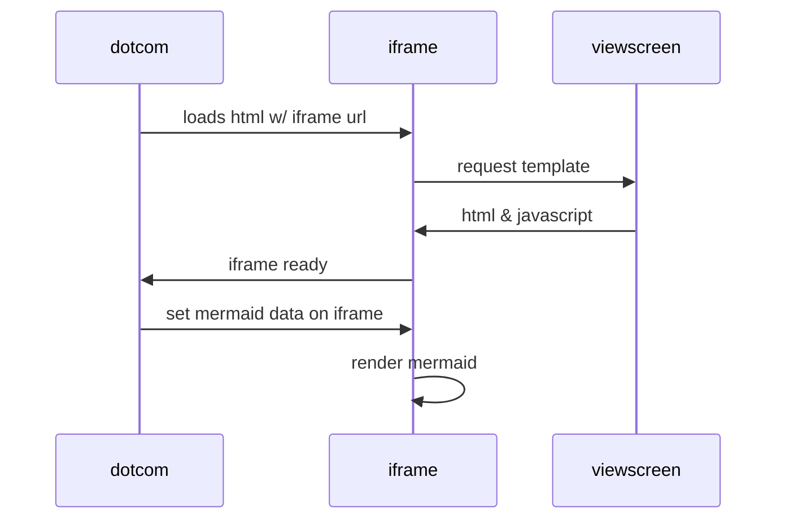

## VMH - Virtual Messaging Hub

The VMH is a UDS (Unix Domain Socket) channel between the enclave and the outside parent instance. This is the only allowed information exchange tunnel. 

According to the enclave security rule, all information that should be kept secret will need to be encrypted before being sent out of the enclave.

When sending message via the VMH, a destination component name is specified so that the corresponding component will receive the messages while other components won't.

