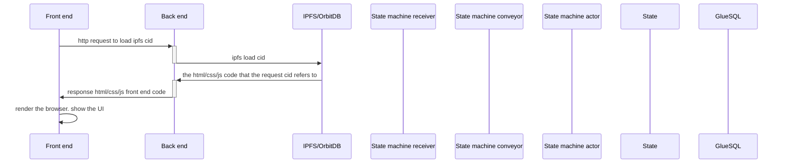
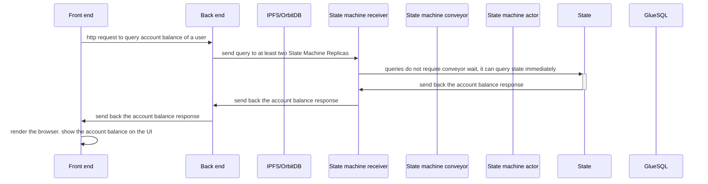

In this section, we'll walk through the TEA Party application's sample code. 

The steps are:

- Clone the code to local.
- Install the build tools.
- Understand the folder structure.
- Understand the compile workflow.
- Run it.

## Code location and structure
Please clone the following github repo to your local machine:
https://github.com/tearust/tapp-sample-teaparty

There are 4 folders (click the links for more details):

- [[party-fe]]: This is the [[front_end]].
- [[party-actor]]: This is the [[back_end_actor]].
- party-share: This is the common data structure or library that shared by both the [[back end  actor]] and the [[state machine actor]].
- [[party-state-actor]]: This is the [[state_machine_actor]].
# Workflow
## Load the UI 
There is no domain of TApps. User click one of the [[hosting CML]]s url to launch tapp. Any of the urls will work exactly the same. You can choose the one with least network latency. The URL is nothing but a IPFS CID.

Note: This is a brief diagram, the real communication is more complicated than this.

## Query the state
Accounting information are stored in the state. For example, when querying the balance of my tapp account.

Query the state can return without waiting in conveyor queue. But the communication is still async, so additional queries for result is needed which is not shown in the diagram. You can see the detail additional queries at [[party-fe#Workflow]].

Note: This is a brief diagram, the real communication is more complicated than this.

# Read details in each of three parts

Click on any of the following links for more details:
Code walkthrough for [[party-fe]]. 
Code walkthrough for [[party-actor]]. 
Code walkthrough for [[party-state-actor]]. 

