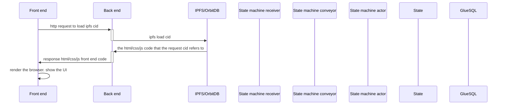
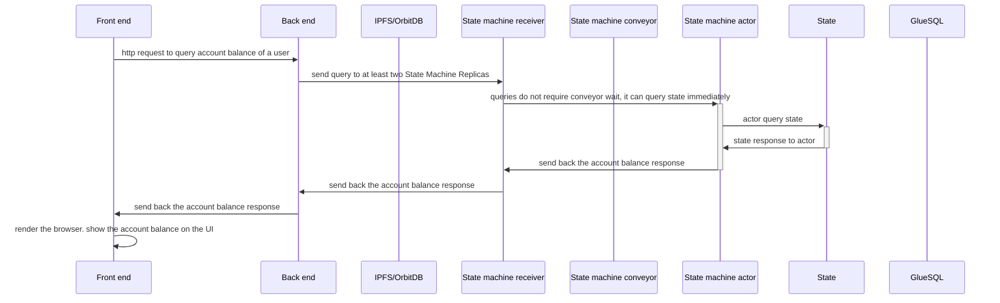
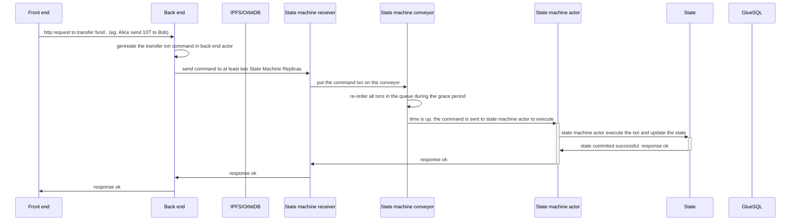
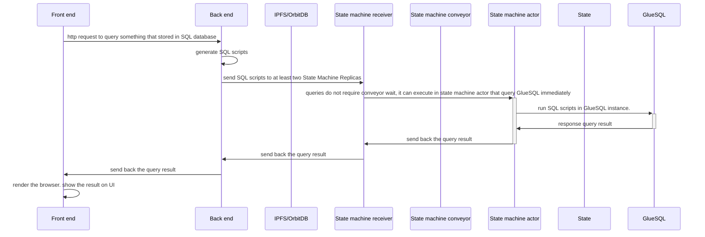
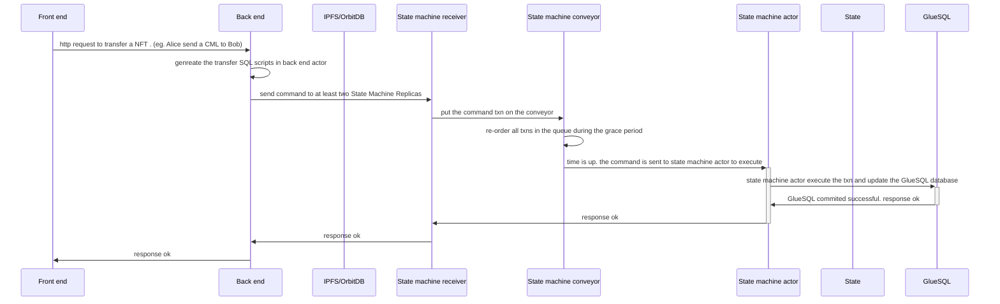
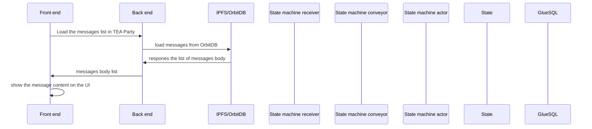
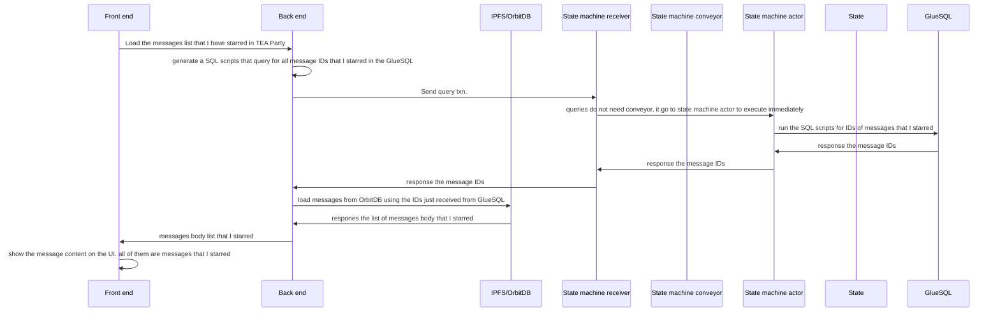

In this section, we'll walk through the TEA Party application's sample code. 

The steps are:

- Clone the code to local.
- Install the build tools.
- Understand the folder structure.
- Understand the compile workflow.
- Run it.

## Code location and structure
Please clone the following github repo to your local machine:
https://github.com/tearust/tapp-sample-teaparty

There are 4 folders (click the links for more details):

- [[party-fe]]: This is the [[front_end]].
- [[party-actor]]: This is the [[back_end_actor]].
- party-share: This is the common data structure or library that shared by both the [[back end  actor]] and the [[state machine actor]].
- [[party-state-actor]]: This is the [[state_machine_actor]].
# Workflow
## Load the UI 
There is no domain of TApps. User click one of the [[hosting CML]]s url to launch tapp. Any of the urls will work exactly the same. You can choose the one with least network latency. The URL is nothing but a IPFS CID.

Note: This is a brief diagram, the real communication is more complicated than this.

## Query the state
Accounting information are stored in the state. For example, when querying the balance of my tapp account.

Query the state can return without waiting in conveyor queue. But the communication is still async, so additional queries for result is needed which is not shown in the diagram. You can see the detail additional queries at [[party-fe#Workflow]].

Note: This is a brief diagram, the real communication is more complicated than this.

## Send command that changes state
Commands are more complicated before it will change the state. Like any other distributed state machine, we have to make sure the state in all [[State_Machine_Replica]] to be consistent. We use the [[conveyor]] algorithm to sort the commands by the timestamp and executed in an identical order across all replicas.

The following diagram demostrates the workflow how a simple transfer txn command to be handled. Note that this diagram is a simplifed verison. The full version can be found here [[party-fe#Workflow]]

## Running SQL queries
Running SQL queries is almost the same as running a query against the state. Only replace the state with GlueSQL instance. Note: SQL queries are not allowed to change the state. `Select` statement is allowed.

## Send SQL scripts to change SQL database
Rather than `select`, many SQL statements will change the database. They are all considered **command**. The workflow is almost the same as the state command. Just replace the state with GlueSQL instance.

## Load / save NoSQL data with OrbitDB
Because the state and GlueSQL are memory based distributed database, they are very expensive when store large data. All large data are supposed to be stored in the OrbitDB(structured data) or IPFS(blob data/ files).

OrbitDB and IPFS live inside the [[hosting_CML]], so the [[State_Machine_Replica]]s are not invovled in this workflow. 

The diagram above shows a common use case that load all messages. But in many cases, the ids (index) of the OrbitDB is stored in GlueSQL, so it is very common that query GlueSQL first to get the IDs, then query OrbitDB using the IDs to get the real data body.

The above diagram shows the combination of SQL and NoSQL. 

# Read details in each of three parts

Click on any of the following links for more details:
Code walkthrough for [[party-fe]]. 
Code walkthrough for [[party-actor]]. 
Code walkthrough for [[party-state-actor]]. 

